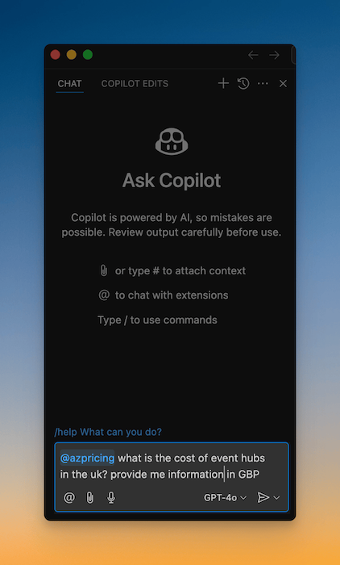

# GitHub Copilot for Azure Pricing

The GitHub Copilot for Azure Pricing extension provides valuable insights into Azure Service pricing. Utilize the powerful GitHub Copilot chat to inquire about pricing details for Azure Services and obtain useful insights.

Simply open GitHub Copilot Chat and start a conversation with @azpricing!

## Demo

<video src="https://github.com/onlyutkarsh/github-copilot-for-azure-pricing/raw/main/demo.mp4"></video>

## Features

### Chat using natural language

### Get useful insights

In addition to pricing details, the responses might also include some useful insights.

> For accurate information, please refer to Azure Pricing Center.

### Copy results

You can copy the response and also raw results as markdown table for your own analysis.

## What Services are supported?

Currently you can query 100+ Azure Services including Virtual Machines, Azure Database for MySQL, Storage, SQL Database, Cognitive Services, Azure Database for PostgreSQL, Azure Monitor, Azure Container Apps, Log Analytics, Azure Cosmos DB, Azure Databricks, Redis Cache, Azure Purview, Azure App Service, SQL Managed Instance, Microsoft Fabric, Application Gateway, Microsoft Defender for Cloud, Event Grid, Container Instances and many more!

> The extension does not support China region.

## Known issues

- Occasionally, the history is not sent with the context, which may result in responses that do not align with the context.

## Disclaimer

The information provided by the GitHub Copilot for Azure Pricing extension may not always be accurate or up-to-date. Users are strongly advised to refer to the Azure Pricing Center for the most reliable and current information before making any decisions.
